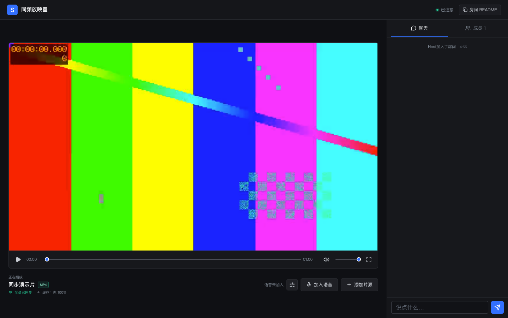
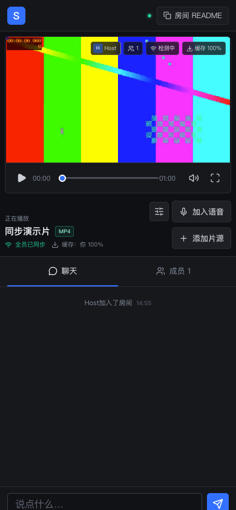
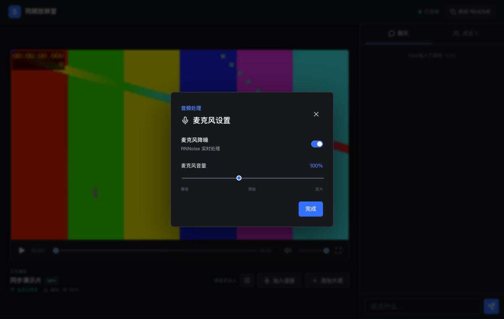

# sync-watch-room

[English](./README.md) | **简体中文**

一个基于 Vue 3、Node.js、WebSocket 和 WebRTC 的轻量级同步观影项目。创建房间、载入 OSS/CDN 视频，即可同步播放、文字聊天和实时语音。

> 项目目标是尽量降低用户感知到的播放偏差，不承诺不同网络和设备之间实现零延迟播放。



| 移动端播放器 | 麦克风设置 |
| --- | --- |
|  |  |

## 功能

- 基于服务端校准时钟，定时执行播放、暂停和拖动指令
- 小幅偏差平滑追帧，大幅偏差直接跳转到权威进度
- 感知成员缓存状态，等待全员可播放后统一开始
- 展示每位成员的缓存进度、延迟、丢包、语音和连接状态
- 实时聊天、正在输入状态、房间事件和成员在线状态
- WebRTC 多人语音、静音、RNNoise 降噪和麦克风音量调节
- 后端签发短期 TURN 凭证，WebRTC 直连失败时自动回退中继
- WebSocket 心跳检测、房间状态恢复和房主自动转移
- 浏览器原生播放 MP4/WebM，通过 `hls.js` 播放 HLS/M3U8
- 支持桌面端与移动端，并提供移动端全屏播放控制

## 技术架构

```text
                         播放状态 / 聊天 / 信令
┌──────────────┐        WebSocket        ┌──────────────────┐
│    浏览器 A   │ ◀────────────────────▶ │   Node.js 服务   │
└──────┬───────┘                         └──────────────────┘
       │  WebRTC DataChannel + 语音              ▲
       ▼                                          │
┌──────────────┐                                  │
│    浏览器 B   │ ─────────────────────────────────┘
└──────┬───────┘
       │ HTTPS 媒体请求
       ▼
┌──────────────┐
│   OSS / CDN  │
└──────────────┘
```

- **WebSocket**：保存可恢复的房间状态，并负责聊天、心跳、房主选举和 WebRTC 信令。
- **WebRTC DataChannel**：在 P2P 连接可用时传递低延迟播放控制事件。
- **WebRTC 音轨**：提供点对点语音通话。
- **OSS/CDN**：存储和分发视频，视频字节不经过房间服务器。

## 环境要求

- Node.js 20.19 或更高版本
- 支持 WebSocket、WebRTC、Web Audio 和 MediaSource 的现代浏览器
- 生产环境使用 HTTPS，以支持麦克风权限和安全 WebSocket

## 快速开始

```bash
git clone https://github.com/<your-account>/sync-watch-room.git
cd sync-watch-room
npm install
npm run dev
```

打开 [http://localhost:4173](http://localhost:4173)。

开发模式下：

- Vite 前端运行在 `4173` 端口。
- Node.js WebSocket 服务运行在 `4174` 端口。
- Vite 将 `/ws` 代理到 WebSocket 服务。

## 命令

| 命令 | 说明 |
| --- | --- |
| `npm run dev` | 同时启动前端和 WebSocket 开发服务 |
| `npm run dev:web` | 仅启动 Vite 前端服务 |
| `npm run dev:server` | 以文件监听模式启动 Node.js 服务端 |
| `npm run build` | 将 Vue 应用构建到 `dist/` |
| `npm run preview` | 预览生产环境前端构建 |
| `npm start` | 由 Node.js 托管 `dist/` 和 WebSocket 连接 |
| `npm test` | 运行 Node.js 服务端测试 |
| `npm run check` | 运行服务端测试并构建生产前端 |

## 视频片源

房主可以载入：

- MP4、WebM 或其他浏览器支持的直链媒体地址
- `hls.js` 或 Safari 原生支持的 HLS/M3U8 地址
- 通过短期签名 URL 暴露的私有 OSS/CDN 资源

为了保证拖动和启动稳定：

- 媒体源需开启 HTTPS 和 CORS。
- 返回正确的 `Content-Type` 和 `Content-Length`。
- MP4/WebM 资源需支持 HTTP Range 请求。
- 所有房间成员必须加载完全一致的媒体版本。

项目不直接播放磁力链接或普通 BitTorrent 节点。生产环境如需支持，应由独立下载/转码任务导入已授权内容，再发布到 OSS/CDN。

## 播放同步

房主操作会携带 `executeAt` 时间戳并提前发送。客户端按照校准后的服务端时钟执行，而不是在收到消息时立即执行。

- 偏差小于 80ms：保持当前播放速度
- 偏差在 80ms 到 300ms：短暂使用 `0.98x` 或 `1.02x` 追齐
- 偏差超过 300ms：跳转到权威房间进度
- 成员缓存不足：暂停统一开始，成员恢复后重新定时播放

## 语音处理

语音通过 WebRTC 音轨传输。麦克风设置包括：

- 基于 RNNoise 的实时降噪
- 可完全关闭的麦克风降噪开关
- `0%`（静音）到 `250%`（放大）的麦克风音量
- 麦克风静音和成员语音状态

P2P 直连时语音不会经过房间服务器。直连失败时，后端会为内置 coturn 服务签发短期凭证，WebRTC 自动尝试 TURN 中继；成员网络状态会显示当前使用 `P2P` 还是 `TURN`。TURN 会消耗服务器带宽，需要按并发量规划容量。

## 生产部署

仓库内已经提供 Vue 前端、Node.js 信令后端和 coturn 中继服务，以及 Nginx WebSocket 反向代理、健康检查、优雅退出和 Docker Compose 编排。

```bash
npm run setup:env
# 对外开放前，请检查生成的域名、公网 IP 和 TURN 配置。
docker compose up --build -d
```

访问 `http://localhost:8088`。生产环境需要在该入口前配置 HTTPS 负载均衡或反向代理。环境变量、独立部署、健康检查、升级流程和扩容限制见[部署指南](./docs/deployment.zh-CN.md)。

服务端仍将房间与聊天记录保存在进程内存中。在房间状态迁移到共享存储、WebSocket 支持按房间路由之前，后端应保持单实例运行。

## 生产化待办

面向公网提供服务时，后续还需要补充以下应用层能力：

- 房间与消息持久化
- 身份认证和房间权限
- TURN 容量限制与用量监控
- 按用户限流和结合权限的严格输入校验
- 共享房间状态与按房间路由的多实例部署
- WebSocket、WebRTC、媒体和房主转移事件监控

## 项目状态

这是一个早期参考实现。同步、聊天、语音、缓冲协调、心跳、房主转移、健康检查、优雅退出和容器化部署已经实现；持久化、身份认证和横向扩容仍是后续工作。

## 参与贡献

欢迎提交 Issue 和 Pull Request。请保持改动聚焦，遵循现有 Vue 和 Node.js 代码风格，并为影响房间同步或媒体播放的行为提供验证步骤。

## 开源协议

[MIT](./LICENSE)
